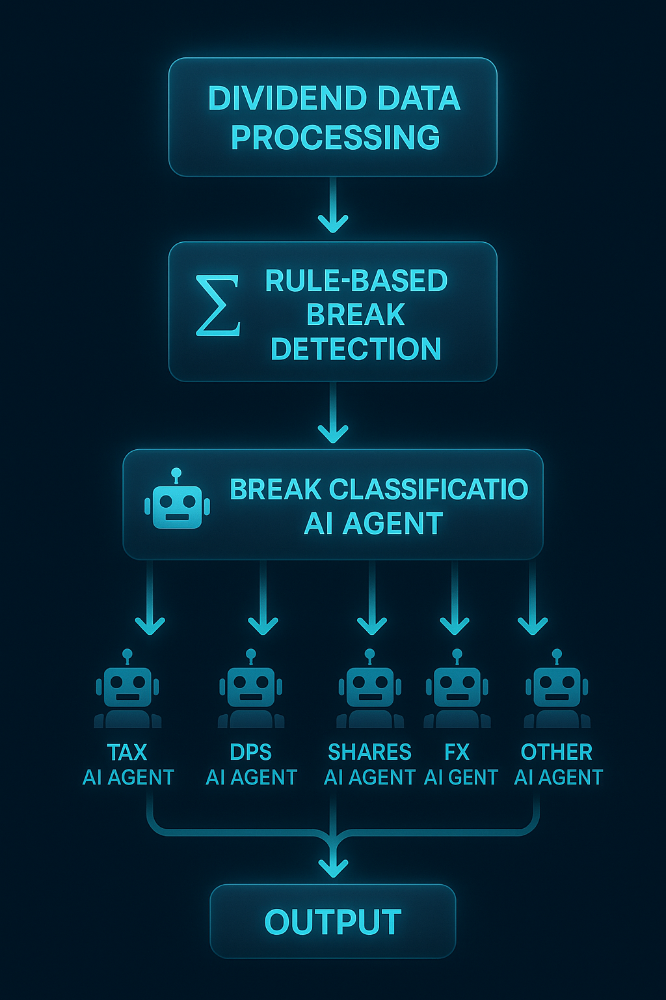

# Dividend Reconciliation Agent

A Streamlit-based application that automatically detects and resolves discrepancies between NBIM and Custody dividend data.

## Quick Start

1. **Install requirements:**
   ```bash
   pip install -r requirements.txt
   ```

2. **Run the application:**
   ```bash
   streamlit run dashboard.py
   ```

3. **Upload files:**
   - In the dashboard, upload two CSV files similar to the sample files in the `data/` folder
   - Click "Process Files" to start reconciliation

## How the logic works

1. **Data Processing**: Merges NBIM and Custody dividend data and prepares the data for the rest of the program.
2. **Rule-based Break Detection**: Identifies discrepancies using rule-based validation. This deterministic approach efficiently processes all data to flag potential breaks, then passes only the relevant information to LLMs for complex reasoning tasks that require domain expertise and external research. 
3. **LLM-based Break Classification**: Uses an LLM agent that receives rule-based break suggestions, then applies domain knowledge and reasoning to validate these breaks, identify additional breaks, and provide detailed descriptions to help resolution agents solve the issues.
4. **LLM-base Resolution**: Specialized agents resolve each break type using domain knowledge, reasoning, internal tools, and web search. Currently implemented for Shares and Tax breaks, with similar agents planned for DPS, FX, and "Other" break types.
5. **Output**: Results saved to `data/output.csv` and displayed in the Streamlit dashboard.

## Architecture Diagram


